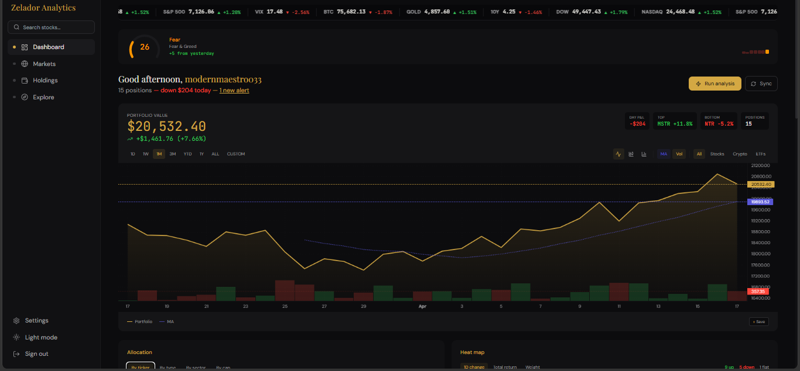
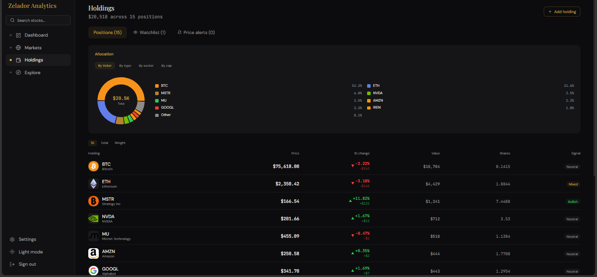
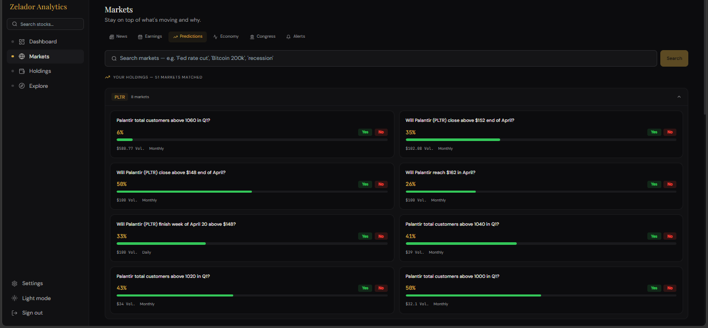
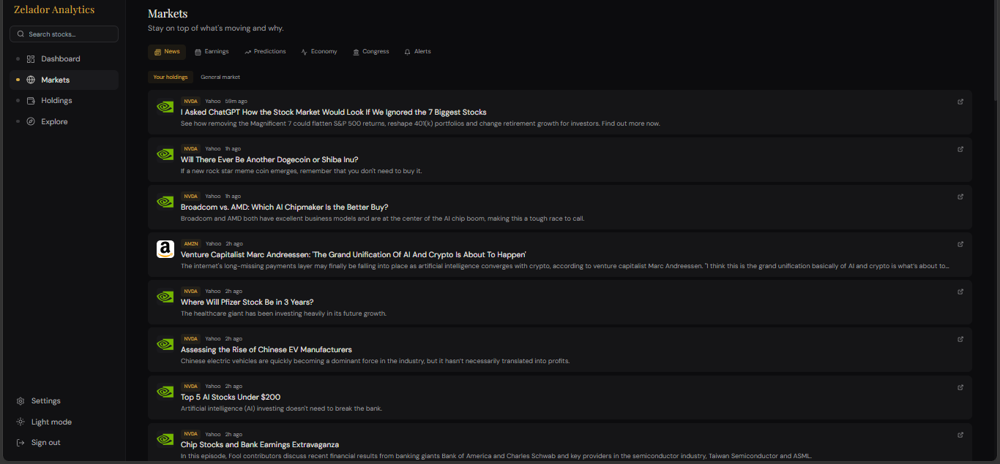
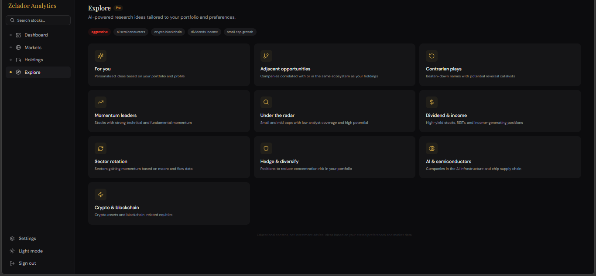
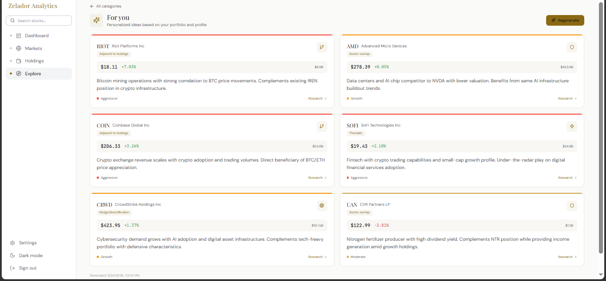

# SignalStack

An AI-powered portfolio intelligence platform that monitors your holdings and delivers actionable research using Claude, prediction markets, insider filings, institutional flow, and macroeconomic indicators.

Built with FastAPI, React, Supabase, and Claude's tool-use API.

Status: Active development. Core features are fully functional including dashboard, holdings, markets feed and AI insights. Polymarket integration is currently partially implemented, and the insider agent is still in development. 

## Screenshots

**Dashboard — portfolio performance with moving average overlay**


**Holdings — position breakdown with AI signals**


**Markets — Polymarket prediction odds tied to your holdings**


**Markets — news feed filtered to your positions**


**Explore — AI research categories**


**Explore — personalized AI investment ideas**


## How It Works

SignalStack runs a **hub-and-spoke agentic architecture** where a coordinator dispatches six specialist AI agents against your portfolio, synthesizes their findings, and delivers intelligence via email digest, push notification, or real-time streaming in the browser.

### The Intelligence Pipeline

When intelligence is generated (on-demand or scheduled), the system:

1. **Builds a fresh context snapshot** — pulls your current holdings, prices, allocation percentages, investor profile preferences, and upcoming earnings dates from Supabase.

2. **Dispatches 6 specialist subagents** sequentially, each with its own tool set and isolated context:

   | Agent | What It Does | Data Sources |
   |-------|-------------|--------------|
   | **Sentiment** | Scores news sentiment per ticker (-1.0 to 1.0), detects trend shifts | Finnhub, NewsAPI |
   | **Polymarket** | Finds prediction market odds relevant to your holdings (earnings beats, macro events) — *partially implemented* | Polymarket Gamma API |
   | **Insider** | Surfaces meaningful insider trades — cluster buying, large open-market purchases — *in development* | SEC EDGAR (Form 4) |
   | **Institutional** | Tracks 13F filings from major funds (Berkshire, Renaissance, Bridgewater) | SEC EDGAR (13F) |
   | **Macro** | Maps Fed rates, CPI, yield curve, unemployment to your specific holdings | FRED |
   | **Profile** | Generates educational research ideas based on your interests and risk appetite | Claude synthesis |

3. **Synthesizes results** — the coordinator combines all six agent outputs into a single structured intelligence report with per-holding narratives, net signal scores, portfolio-level insights, and concentration warnings.

4. **Enforces compliance programmatically** — a hooks pipeline (not prompt instructions) blocks advice language ("buy", "sell", "you should"), injects the disclaimer, redacts PII, and normalizes timestamps.

### The Agentic Loop

Each agent runs inside `run_agent_loop()`, which implements Claude's tool-use protocol:

```
Send request to Claude API with tools
  -> stop_reason == "tool_use"  -> execute tools, append results, loop
  -> stop_reason == "end_turn"  -> return final output
```

The loop is **model-driven** — Claude decides which tools to call and in what order. A 25-iteration safety cap exists as a backstop but is never the primary termination signal. Pre-execution hooks can block tool calls (e.g., gating features by subscription tier), and post-execution hooks normalize all tool outputs before they re-enter the conversation.

### Cost Control

Every intelligence run tracks token usage and estimated cost. A per-user daily spend cap ($0.50 default) automatically:
- Switches to the fallback model (Haiku) when the cap is approached
- Serves cached intelligence when the cap is hit
- Resets at midnight UTC

## Architecture

```
Browser (React PWA)
  |
  |-- SSE stream (/intelligence/stream)
  |-- REST API (/api/v1/*)
  |
Caddy (reverse proxy, auto-HTTPS)
  |
FastAPI (uvicorn)
  |-- API routes (auth, portfolio, research, billing, etc.)
  |-- Intelligence engine (coordinator + 6 subagents)
  |-- Hooks pipeline (pre/post execution, output interception)
  |
Celery + Redis
  |-- Daily digest (4-10 PM UTC, timezone-aware delivery)
  |-- Weekly report (Sunday evenings)
  |-- Price monitor (every 5 min during market hours)
  |-- Pre-earnings briefings (8 AM & 4 PM ET)
  |-- Portfolio sync (every 30 min, market hours)
  |-- Polymarket catalog sync (every 30 min)
  |
Supabase (PostgreSQL + Auth + RLS)
  |-- Row-level security on all user tables
  |-- JWT verification server-side via PyJWT
  |
External APIs
  |-- Claude (intelligence generation)
  |-- Polymarket Gamma API (prediction markets)
  |-- Finnhub (quotes, news, insider trades)
  |-- FRED (macro indicators)
  |-- SEC EDGAR (13F filings)
  |-- SnapTrade (brokerage OAuth)
  |-- Stripe (billing)
  |-- Resend (email delivery)
  |-- Web Push (VAPID notifications)
```

## Tech Stack

**Backend:** Python 3.11, FastAPI, Celery, Redis, Supabase (PostgreSQL), yfinance

**Frontend:** React 18, TypeScript, Tailwind CSS, Vite, Lightweight Charts, PWA with service worker

**AI:** Claude API (Anthropic) with structured tool use — hub-and-spoke coordinator pattern

**Infrastructure:** Docker Compose, Caddy (auto-HTTPS via Let's Encrypt), AWS EC2

## Backend Structure

```
backend/
  agents/          # Coordinator, subagent definitions, agentic loop
  api/             # FastAPI route handlers (22 modules)
  jobs/            # Celery tasks, beat schedule, job tracker
  middleware/      # Rate limiting (tier-based)
  models/          # Pydantic schemas
  services/        # Auth, Supabase client, email, push, cost control,
                   #   SnapTrade encryption, Polymarket auto-tagger
  tools/           # MCP-style tool implementations (Finnhub, FRED,
                   #   Polymarket, SEC EDGAR, etc.)
```

### Key Design Decisions

**Programmatic compliance, not prompt compliance.** Financial disclaimers, advice language filtering, PII redaction, and concentration warnings are enforced by code hooks — never trusted to the model following instructions. The output interceptor scans every response for patterns like "I recommend" or "you should buy" and blocks the response for reformulation.

**Subagent isolation.** Each subagent runs with zero shared context — no access to the coordinator's conversation history, no memory of other subagents' outputs. Every piece of context a subagent needs is explicitly passed in its prompt. This prevents cross-contamination and makes agent behavior deterministic.

**DB-first Polymarket integration.** A background job syncs all active markets from Polymarket's finance categories (`stocks`, `earnings`, `crypto`, `commodities`, `fed-rates`, `indices`, `ipos`, `forex`, `acquisitions`) every 30 minutes. Markets are auto-tagged to stock tickers via keyword rules. Research pages and the prediction markets panel do fast DB lookups instead of live API searches.

**Structured JSON, not prose.** Subagents return structured JSON back to the coordinator, not natural language. This makes synthesis reliable and the frontend rendering predictable.

## Frontend Structure

```
frontend/src/
  api/             # Centralized API client with JWT auto-refresh
  components/      # Reusable UI (PriceChart, PolymarketPanel,
                   #   OnboardingModal, IntelligenceProgress, etc.)
  hooks/           # useAuth, useTheme, useIntelligenceStream
  pages/           # Dashboard, Research, Earnings, Explore,
                   #   Settings, Landing, Public Research
```

### Real-Time Intelligence Streaming

When a user triggers intelligence generation, the frontend connects via SSE (Server-Sent Events) using `fetch()` + `ReadableStream` (not `EventSource`, which can't send auth headers). The stream emits:

- `agent_start` — agent name and index (drives the progress UI)
- `agent_done` — agent status, duration, errors
- `complete` — final synthesis with per-holding narratives and signals
- `error` — failure details

The UI shows a live progress bar with agent-by-agent status updates as each specialist completes its analysis.

## Scheduled Jobs

| Job | Schedule | Purpose |
|-----|----------|---------|
| Daily Digest | Hourly 4-10 PM UTC | Delivers intelligence at each user's local 5 PM |
| Weekly Report | Sundays 6-11 PM UTC | Full portfolio review for the week |
| Price Monitor | Every 5 min (market hours) | "Why is this moving?" alerts on >3% swings |
| Pre-Earnings | 8 AM & 4 PM ET | Briefings for holdings with earnings in 5 days |
| Portfolio Sync | Every 30 min (market hours) | Refreshes brokerage holdings via SnapTrade |
| Polymarket Sync | Every 30 min | Updates prediction market catalog from Polymarket |

## Research Pages

Each ticker gets a full research page (`/app/research/NVDA`) with:

- **Price chart** — Lightweight Charts with 7 timeframes (1D to 5Y), candlestick/area toggle, SMA 20/50 overlays, volume, high/low markers
- **Fundamentals** — P/E, market cap, 52-week range, dividend yield, analyst recommendations
- **Prediction markets** — Ticker-specific and macro Polymarket odds with probability bars
- **Financial statements** — Income, balance sheet, cash flow (quarterly)
- **Institutional holders** — Top 10 funds by position size
- **Similar stocks** — Sector/industry peers
- **News** — Recent headlines with sentiment scoring

Public research pages (`/research/NVDA`) are available without authentication for SEO, with OG image generation for social sharing.

## Billing

Two tiers: **Free** and **Pro** ($15/month via Stripe).

- Free: 20 requests/min, daily intelligence, basic research
- Pro: 100 requests/min, real-time alerts, weekly reports, pre-earnings briefings

Stripe Checkout handles payment, webhooks manage tier transitions, and referral codes provide credits on upgrade.

## Security

- Supabase Row-Level Security on all user tables
- JWT verification server-side via PyJWT
- SnapTrade brokerage tokens encrypted with Fernet before storage
- Caddy security headers (HSTS, CSP, X-Frame-Options)
- UFW firewall + fail2ban on EC2
- Non-root Docker user
- Rate limiting per user tier
- Stripe webhook signature verification

## Running Locally

```bash
# Database — apply migrations/001..003 in order in the Supabase SQL editor
# (see migrations/README.md; validate the chain locally with
#  scripts/validate_migrations.sh)

# Backend
pip install -r backend/requirements.txt
uvicorn backend.main:app --reload --port 8000

# Frontend
cd frontend
npm install
npm run dev

# Workers
celery -A backend.jobs.celery_app worker --loglevel=info
celery -A backend.jobs.celery_app beat --loglevel=info
```

Requires `.env` with Supabase, Anthropic, and Redis credentials at minimum
(see `.env.example`).

## Running Tests

```bash
pip install -r backend/requirements.txt -r requirements-dev.txt
pytest
```

The suite mocks all external APIs and needs no `.env` — fake configuration
is injected by `tests/conftest.py`.

## Deploying

```bash
ssh ubuntu@<ec2-ip>
cd ~/signalstack
# Fill .env with production values
./deploy.sh
```

`deploy.sh` installs Docker, configures the firewall, builds the frontend, and launches the full stack via `docker-compose.prod.yml` (Caddy + API + Celery worker + Celery beat + Redis).

## File Counts

- **63** Python modules (backend)
- **36** React components/pages (frontend)
- **13** Celery tasks
- **6** specialist AI agents
- **10** external API integrations
