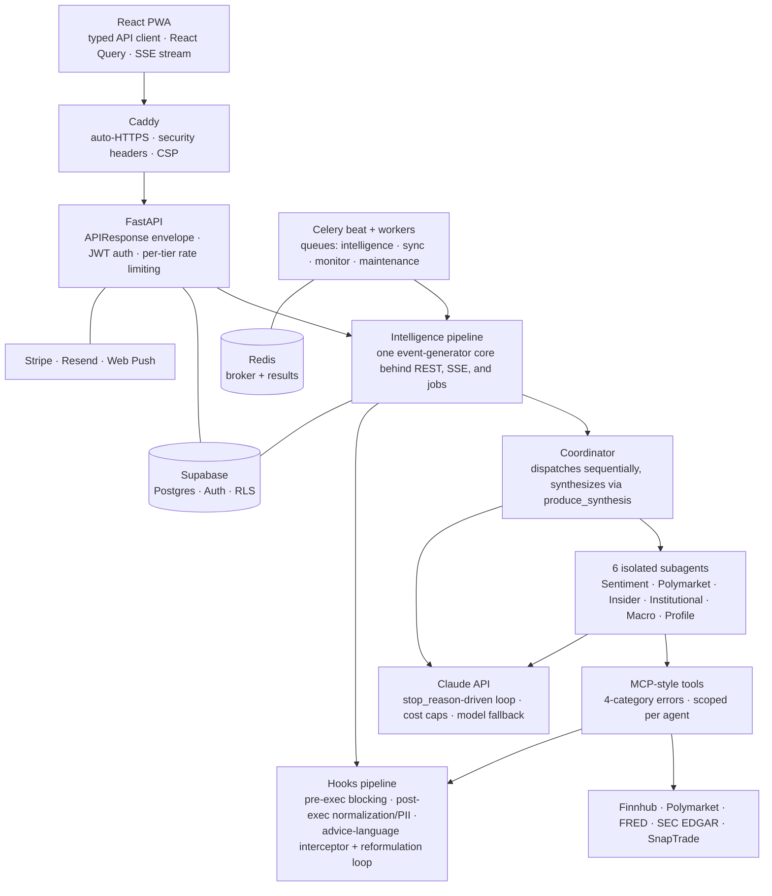

# SignalStack

[](https://github.com/DMota18/signalstack/actions/workflows/ci.yml)

**An AI system that reads your investment holdings and gives you a plain-English intelligence report on each one — pulling automatically from news, insider filings, big-investor holdings, prediction markets, and economic data.**

Built with FastAPI, React, Supabase, and Claude's tool-use API.

> **Status:** Portfolio project — a complete, previously-deployed build, not a product with users and not currently running live. Core features (dashboard, holdings, markets feed, real-time AI intelligence) are fully functional. Two of the six signal agents are intentionally less complete: the **Polymarket** agent is partially implemented and the **Insider** agent is in development — both degrade gracefully and are reported as gaps in the output, never hidden. See [Known Limitations](#known-limitations--roadmap) and the [Engineering Retrospective](./RETROSPECTIVE.md).

---

## What it does

You connect your brokerage holdings. For each position you hold, SignalStack gathers signals from several independent sources at once — news, company insiders, large funds, prediction markets, and the macro backdrop — then combines them into a single, readable report on that holding.

It is **not financial advice.** The goal is to pull together as much real information as possible in one place so you can make your own decisions. A safe-language check runs over every output to keep it informational, not advisory — enforced in code, not left to the model.

Reports can be delivered three ways: streamed live in the browser (with a progress bar as each source comes back), sent as an email digest, or pushed as a notification.

## Screenshots

**Dashboard — portfolio performance with moving average overlay**


**Holdings — position breakdown with AI signals**


**Markets — Polymarket prediction odds tied to your holdings**


**Markets — news feed filtered to your positions**


**Explore — AI research categories**


**Explore — personalized AI investment ideas**


---

## The six agents

SignalStack runs six specialist agents, each responsible for one kind of signal. Each one only does its own job and only sees its own data, and each returns a structured summary the coordinator can combine.

| Agent | What it does | Data sources |
|-------|-------------|--------------|
| **Sentiment** | Scores recent news tone per ticker on a bearish-to-bullish scale, weighting meaningful coverage over noise and flagging when a ticker has no coverage | Finnhub, NewsAPI |
| **Prediction markets** | Finds active Polymarket markets tied to a holding (company, ticker, industry) and surfaces the crowd's real-money implied odds on events that could move the stock — *partially implemented* | Polymarket Gamma API |
| **Insider** | Scans SEC Form 4 filings for *meaningful* insider activity — large open-market and cluster buys by executives — filtering out routine sales and option exercises — *in development* | SEC EDGAR (Form 4) |
| **Institutional** | Reads quarterly 13F filings to track what major funds (Berkshire, Renaissance, Citadel, BlackRock) hold and are changing, noting 13F data runs 1–3 months stale | SEC EDGAR (13F) |
| **Macro** | Maps relevant Fed/FRED indicators — rates, inflation, employment, sector series — onto the portfolio's actual exposures rather than dumping raw data | FRED |
| **Profile** | Generates educational research ideas grounded in the user's stated interests, framed as "based on your interests," not recommendations. Powers the Explore screen | Claude synthesis |

Agent maturity varies — the two flagged above are less complete than the rest. The [Engineering Retrospective](./RETROSPECTIVE.md) has the honest current state of each.

---

## Architecture

A **hub-and-spoke** design: a coordinator sits in the middle, the six specialists are the spokes. The specialists gather; the coordinator combines.



**Why hub-and-spoke instead of one big agent with all the tools?** Three reasons:

- **Tool reliability.** When one agent has too many tools to choose from, it picks the wrong one more often. Each specialist carries only a handful of tools (4–5 max), so each stays sharp.
- **Context isolation.** Each agent gets its own prompt and only its own data — no shared memory. The macro agent never sees the news agent's headlines. That keeps each agent predictable and independently testable.
- **Clean combining.** Each specialist returns a small, fixed-shape JSON summary, so the coordinator combines six clean pieces instead of one sprawling transcript.

**What's fixed vs. what the AI decides:** which agents run is a fixed list — all six run every time. The coordinator uses its own judgment only at the final combining step. Inside each agent, the model decides which of its own tools to call and in what order.

### The agentic loop

Each agent runs inside `run_agent_loop()`, which implements Claude's tool-use protocol:

```
Send request to Claude API with tools
  -> stop_reason == "tool_use"  -> execute tools, append results, loop
  -> stop_reason == "end_turn"  -> return final output
```

The loop is **model-driven** — Claude decides which tools to call and in what order. A 25-iteration safety cap exists as a backstop but is never the primary termination signal. Pre-execution hooks can block tool calls (e.g., gating features by subscription tier); post-execution hooks normalize every tool output before it re-enters the conversation.

### Scheduled work

Celery beat (all UTC — delivery respects each user's timezone via `zoneinfo`): daily digest scans hourly 4–10 PM, weekly report Sunday evenings, price monitor every 5 minutes in market hours, pre-earnings briefings twice daily, portfolio + Polymarket catalog syncs every 30 minutes.

---

## Engineering decisions worth calling out

- **Hand-built tool-use loop on the raw API.** Rather than lean on a pre-built SDK, the request → tool-call → response cycle is built by hand, so the whole loop is understood and controllable end to end. The **only** valid termination signal is `stop_reason` — never natural-language parsing, never an arbitrary iteration count.

- **Programmatic compliance, not prompt compliance.** Financial disclaimers, advice-language filtering, PII redaction, and concentration warnings are enforced by code hooks — never trusted to the model following instructions. The output interceptor scans every response for patterns like "I recommend" or "you should buy" and blocks it for reformulation. Because REST, SSE streaming, and scheduled jobs all share one pipeline core, no delivery path can skip it.

- **Subagent isolation.** Each subagent runs with zero shared context — no access to the coordinator's history, no memory of other subagents. Every piece of context a subagent needs is passed explicitly in its prompt. This prevents cross-contamination and makes agent behavior independently testable.

- **Cost is capped hard.** A per-user daily spend cap ($0.50/user/day default) plus a cached last-good report once the cap is hit bounds the worst case absolutely — a single user can't run up a large bill no matter what. In the 70–100% band the final synthesis call falls back to a cheaper model (Haiku) while the six subagents stay on the primary model (a partial lever — the bulk of the tokens are in the subagent fan-out); once the cap is hit it serves cached intelligence; everything resets at midnight UTC.

- **Graceful degradation.** If one agent fails or times out, the run doesn't crash. The other agents' findings still come through and the report notes the missing piece explicitly.

- **Structured JSON, not prose.** Subagents return fixed-shape JSON to the coordinator, not natural language — a subagent returning prose is treated as a failure, not silently accepted. This makes synthesis reliable and frontend rendering predictable.

- **Live stream over a plain spinner.** A full report takes a few minutes, so the browser streams each agent's progress as it finishes — turning a long blank wait into a visible pipeline. Built on `fetch` + a `ReadableStream` rather than the browser's built-in `EventSource`, because the reports sit behind a login and the request needs to carry an auth header.

---

## Tech stack

**Backend:** Python 3.11, FastAPI, Celery, Redis, Supabase (PostgreSQL with Row-Level Security), yfinance

**Frontend:** React 18, TypeScript, Tailwind CSS, Vite, Lightweight Charts, PWA (vite-plugin-pwa + Workbox)

**AI:** Claude API (Anthropic) with structured tool use — hand-built hub-and-spoke coordinator pattern, no SDK

**Infrastructure:** Docker Compose, Caddy (auto-HTTPS via Let's Encrypt), AWS EC2

**Quality tooling:** pytest + ruff (backend), vitest + ESLint + Prettier (frontend), GitHub Actions CI (lint, tests, production build, and the migration chain applied against a real Postgres on every push)

### Project structure

```
backend/
  agents/       # Coordinator, subagent definitions, agentic loop
  api/          # FastAPI route handlers
  jobs/         # Celery tasks, beat schedule, job tracker
  middleware/   # Tier-based rate limiting
  models/       # Pydantic schemas
  services/     # Auth, Supabase client, email, push, cost control,
                #   SnapTrade encryption, Polymarket auto-tagger, hooks
  tools/        # MCP-style tool implementations (Finnhub, FRED,
                #   Polymarket, SEC EDGAR, etc.)
frontend/src/
  api/          # Centralized typed API client with JWT auto-refresh
  components/   # Reusable UI (charts, panels, onboarding, progress)
  hooks/        # useAuth, useTheme, useIntelligenceStream
  pages/        # Dashboard, Research, Explore, Settings, Landing
migrations/     # SQL schema chain (001–004), reproducible from clone
tests/          # Backend suites by domain
```

---

## Running it

**This is a configured application, not a zero-config demo.** To actually run it you need real credentials — a Supabase (Postgres) project, an Anthropic API key, a Redis instance, and the external data-provider keys the agents use. The only thing that runs with no setup is the [test suite](#running-tests), which mocks every external service.

**Step 0 — create your `.env` (required):** copy `.env.example` to `.env` and fill in the values. Every run path below reads it, and `docker compose` in particular declares `env_file: .env` — **without a `.env` file present, `docker compose up` exits immediately** with an "env file not found" error.

```bash
cp .env.example .env      # then fill in Supabase, Anthropic, Redis + provider keys
```

Manual (four processes):

```bash
# 1. Database — apply migrations/001..004 in order in the Supabase SQL editor.
#    Validate the chain locally against a throwaway Postgres first:
scripts/validate_migrations.sh

# 2. Backend API
pip install -r backend/requirements.txt
uvicorn backend.main:app --reload --port 8000

# 3. Frontend
cd frontend
npm install
npm run dev

# 4. Background workers (separate terminals)
celery -A backend.jobs.celery_app worker --loglevel=info
celery -A backend.jobs.celery_app beat   --loglevel=info
```

Or bring up the whole backend stack (API + worker + beat + Redis) with Docker Compose — this reads `.env` (Step 0) and fails without it:

```bash
docker compose up --build
```

### Running tests

```bash
# Backend — mocks all external APIs, needs no .env
#   (fake config is injected by tests/conftest.py)
pip install -r backend/requirements.txt -r requirements-dev.txt
pytest

# Frontend — API client auth/refresh contract + SSE parsing
cd frontend && npm test
```

CI runs both suites, lint on both sides, the production build, and applies the full migration chain against a real Postgres on every push.

### Deploying

```bash
ssh ubuntu@<host>
cd ~/signalstack
# Fill .env with production values (including DOMAIN)
./deploy.sh
```

`deploy.sh` installs Docker, configures the firewall (UFW + fail2ban), builds the frontend, and launches the full stack via `docker-compose.prod.yml` (Caddy + API + Celery worker + Celery beat + Redis). Every public URL — CORS, email links, SEO/OG tags, OAuth redirects — is derived from the single `DOMAIN` variable, so the app is not tied to any one hostname.

---

## Security

- Supabase Row-Level Security on all user tables — users see only their own rows
- JWT verified server-side via PyJWT
- SnapTrade brokerage tokens encrypted with Fernet before storage — the database stores ciphertext only; tokens are never logged and never passed to Claude
- Caddy security headers (HSTS, CSP, X-Frame-Options)
- UFW firewall + fail2ban, non-root Docker user
- Per-tier rate limiting; Stripe webhook signature verification

## Known Limitations & Roadmap

Honest state of the edges — these are deliberate scoping decisions, not surprises:

- **Insider agent** is still in development (SEC EDGAR Form 4 parsing); **Polymarket agent** is partially implemented — both degrade gracefully and are reported as gaps in the synthesis, never hidden.
- **Rate limiting** is an in-process sliding window — correct per instance, but multi-instance deployment would move the counters to Redis.
- **Frontend `any` reduction is ongoing:** the API client and portfolio pages are fully typed; remaining usages are tracked as ESLint warnings rather than suppressed, so the debt stays visible.
- **React Query** is adopted on the portfolio pages; remaining pages migrate incrementally as they're touched.
- **Offline mode** serves the precached app shell and last-cached data; an explicit "data may be stale" banner is on the roadmap.
- **Prompt caching** on the Case Facts block across the six-agent fan-out is the next obvious Claude cost win.

The full deep-dive — where the running code diverges from the original design, which of those are deliberate trade-offs and which were bugs, and what I'd build differently next — lives in the **[Engineering Retrospective](./RETROSPECTIVE.md)**.

---

**Repo:** https://github.com/DMota18/signalstack
